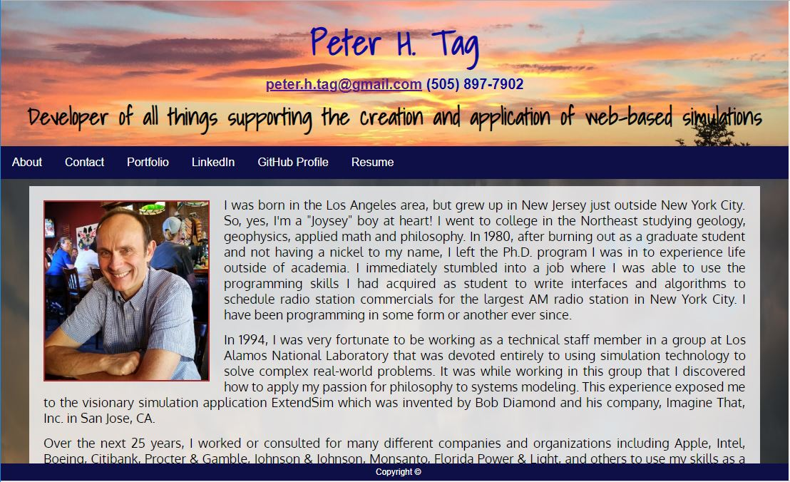

# Updated-portfolio
Week 9 homework assignment - UC Davis Extension Full-Stack Bootcamp Course
### Overview
This homework assignment required us to update our portfolio page to make it employer ready. 

### Purpose
The project taught us how to use HTML/CSS, frameworks and Javascripts in order to effectively market ourselves to prospective employees.

### Assignment Description
In this assignment, I decided to use a single-page design using CSS grid styling instead of Bootstrap or Materialize or other CSS frameworks. I wanted to learn how to style my portfolio page organically from the ground up using straight CSS alone in conjunction with Javascript to manage scrolling and form events.

